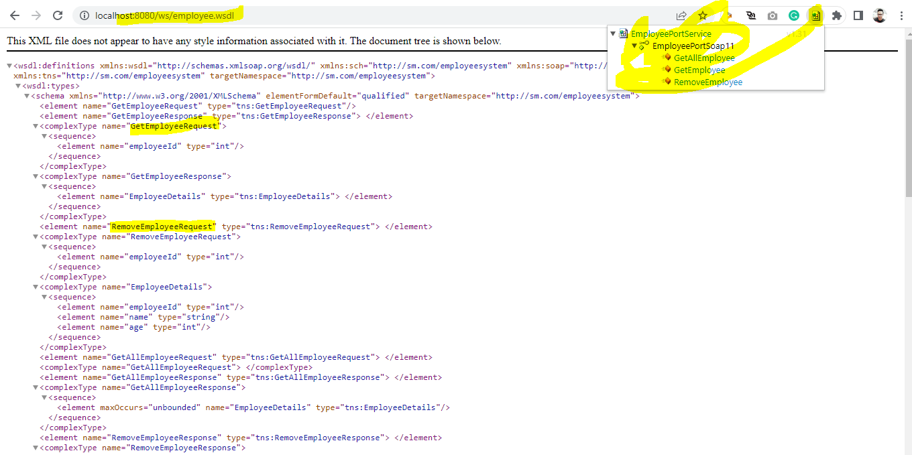
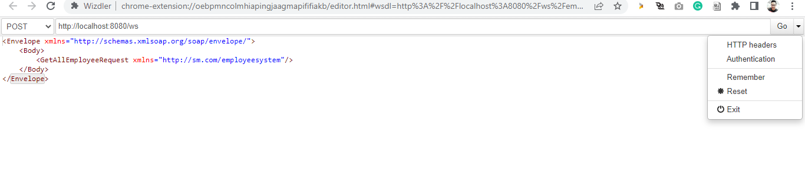
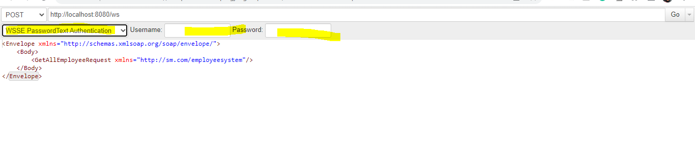
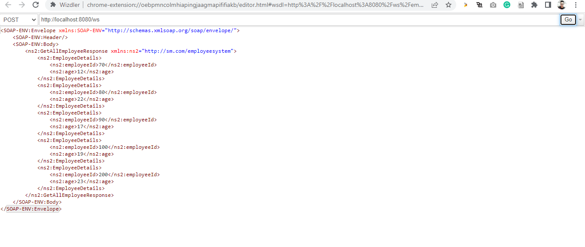

## Spring Soap project

- Namespace: http://sm.com/employeesystem

- WSDL URL: http://localhost:8080/ws/employee.wsdl

- Wizdler chrome extension : Parse wsdl file and generate SOAP messages

### Login API Http METHOD : GET

Open wsdl url in the browser and select wizdler to see the operations, use authentication and provide credentials.
Without credentials it will be failed.
XSD file is present in the resources folder and it is being used to generate classes using maven jaxb plugin

username: hello
password: world

#### First Step

#### Second Step

#### Third Step

#### Fourth Step
